# ASEAN Voice Intelligence

**Automatic Speech Recognition dan Text-to-Speech Berbahasa Indonesia**

Proyek ini adalah aplikasi AI suara berbasis Python yang menggabungkan **keyword spotting ASR** untuk 10 nama negara ASEAN, **Text-to-Speech Bahasa Indonesia**, serta dua antarmuka presentasi: **desktop GUI** dan **web dashboard**. Seluruh pipeline ASR dibangun secara mandiri menggunakan preprocessing audio, ekstraksi **MFCC**, model **MLPClassifier**, dan eksperimen **CNN 1D** untuk inferensi real-time.

**Repository:** `asean-voice-intelligence`

## Tech Stack

[](https://www.python.org/)
[](https://www.tensorflow.org/)
[](https://www.gradio.app/)
[](https://github.com/TomSchimansky/CustomTkinter)
[](https://scikit-learn.org/)
[](https://librosa.org/)

## Feature Highlights

- ASR keyword spotting terbatas untuk 10 nama negara ASEAN.
- Pipeline ASR mandiri: preprocessing audio, MFCC, training, inferensi.
- Model pembanding: **MLPClassifier** dan **CNN 1D**.
- Realtime microphone inference dengan confidence score.
- Visualisasi waveform dan MFCC.
- Desktop GUI dengan **CustomTkinter**.
- Web dashboard modern dengan **Gradio**.
- TTS Bahasa Indonesia dengan opsi speed, gender, dan export audio.
- Integrasi **ASR → TTS** untuk demo dua arah.

## Project Overview

Tujuan utama proyek ini adalah membangun sistem pengenalan suara skala terbatas yang tetap kuat secara akademik dan menarik untuk demonstrasi UAS. Fokus utama bukan transkripsi bebas, melainkan **speech keyword recognition** pada 10 kata kunci berupa nama negara ASEAN:

- Indonesia
- Malaysia
- Thailand
- Singapura
- Vietnam
- Laos
- Myanmar
- Filipina
- Brunei
- Kamboja

Sistem menyediakan dua jalur utama:

- **Desktop mode** untuk demo lokal, realtime recognition, dan integrasi TTS.
- **Web mode** untuk dashboard presentasi berbasis browser dengan CNN 1D.

## Features Demonstrated

- Dataset audio per kelas dan tooling pengambilan data.
- Preprocessing audio: resample, mono conversion, trimming, normalization, padding.
- Ekstraksi MFCC untuk representasi fitur audio.
- Training dan evaluasi model MLP.
- Training dan evaluasi model CNN 1D.
- Realtime inference dari mikrofon.
- Confidence score dan top-k prediction.
- Visualisasi MFCC pada antarmuka.
- TTS Bahasa Indonesia dengan pilihan gender dan speed.
- Export audio dalam format WAV atau MP3.
- Integrasi hasil ASR langsung ke panel TTS.

## Dataset Structure

Dataset disusun per label sehingga mudah dipahami saat training dan presentasi.

```text
dataset/
  Brunei/
  Filipina/
  Indonesia/
  Kamboja/
  Laos/
  Malaysia/
  Myanmar/
  Singapura/
  Thailand/
  Vietnam/
```

Rekomendasi data yang digunakan:

- Format: `.wav`
- Sample rate target: `16000 Hz`
- Durasi per rekaman: sekitar `1.0–1.5 detik`
- Speaker: lebih dari satu untuk meningkatkan generalisasi
- Variasi: tempo, intonasi, dan kondisi perekaman berbeda

## Repository Structure

Struktur yang direkomendasikan untuk repo ini:

```text
asean-voice-intelligence/
├── app.py
├── web_app.py
├── README.md
├── requirements.txt
├── requirements_web.txt
├── assets/
├── docs/
├── gui/
├── models/
├── outputs/
├── scripts/
├── train/
└── utils/
```

Folder yang paling penting untuk presentasi dan bukti hasil:

- `assets/` untuk screenshot dan ilustrasi.
- `models/` untuk model terlatih dan metadata.
- `outputs/` untuk classification report, confusion matrix, dan report evaluasi.
- `docs/` untuk template laporan dan materi presentasi.

## Architecture Overview

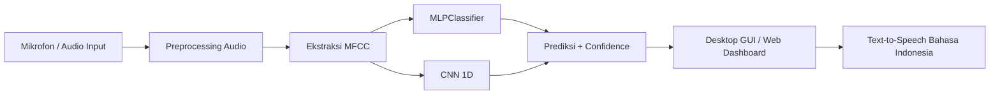

Arsitektur ini menunjukkan bahwa sistem berjalan melalui tiga lapisan utama:

1. **Audio layer**: capture, trimming, normalization.
2. **Feature layer**: MFCC sebagai representasi utama.
3. **Model layer**: MLP dan CNN untuk klasifikasi keyword.

## Realtime Pipeline

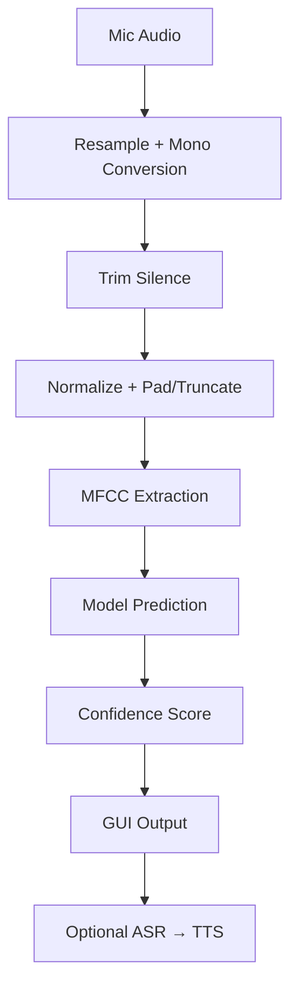

Pada mode realtime, aplikasi menangkap audio dari mikrofon, memprosesnya ke format yang konsisten, lalu memprediksi label yang paling sesuai. Untuk menjaga stabilitas, sistem juga menggunakan smoothing dan threshold confidence.

## GUI Overview

### Desktop GUI

Desktop application dibangun dengan **CustomTkinter** dan dibagi menjadi dua panel utama:

- **ASR Panel** untuk realtime recognition, confidence, top-k, dan visualisasi MFCC.
- **TTS Panel** untuk input teks, pemilihan speed/gender, playback, dan penyimpanan audio.

### Web Dashboard

Versi web dibangun dengan **Gradio** untuk kebutuhan demo browser. Dashboard ini menampilkan inferensi CNN, visualisasi MFCC, dan elemen presentasi yang lebih modern untuk sidang.

## Installation

### Desktop Environment

```bash
python -m venv .venv
.\.venv\Scripts\activate
pip install -r requirements.txt
```

### Web Environment

```powershell
./cnn-env/Scripts/Activate.ps1
python -m pip install -r requirements_web.txt
```

### Notes

- Disarankan memakai Windows untuk demo desktop karena TTS offline menggunakan SAPI5.
- Jika audio input bermasalah, pastikan mic aktif dan tidak digunakan aplikasi lain.

## Training Steps

1. Siapkan dataset audio per label.
2. Rekam data jika diperlukan.
3. Jalankan training MLP.

```bash
python scripts/record_dataset.py --label Indonesia --count 10
python train/train_mlp.py
```

### Output Training MLP

- `models/asr_mlp.joblib`
- `models/asr_meta.json`
- `outputs/confusion_matrix.png`
- `outputs/classification_report.txt`
- `outputs/classification_report.json`
- `outputs/train_report.json`

### Output Training CNN

- `models/asr_cnn.h5`
- `outputs/confusion_matrix_cnn.png`
- `outputs/classification_report_cnn.txt`
- `outputs/classification_report_cnn.json`
- `outputs/train_report_cnn.json`

## Inference Steps

### Desktop ASR

```bash
python app.py
```

### Web ASR Dashboard

```powershell
python web_app.py
```

Fitur inference yang dapat didemonstrasikan:

- Realtime microphone inference.
- Record once untuk input yang lebih stabil.
- Auto-fill hasil ASR ke panel TTS.

## Web Dashboard

Web dashboard disiapkan sebagai versi demo yang lebih mudah ditunjukkan di browser. Fokus utamanya adalah penggunaan **CNN 1D** untuk inferensi audio berbasis MFCC.

Komponen utama yang ditampilkan:

- panel realtime prediction,
- visualisasi MFCC,
- confidence score,
- output prediksi label,
- panel TTS pendamping.

## MLP Evaluation

Evaluasi model MLP menunjukkan bahwa pendekatan berbasis fitur statistik MFCC sudah cukup baik untuk baseline keyword spotting.

| Metrik   | Nilai  |
| -------- | ------ |
| Accuracy | 80.28% |
| Macro F1 | 80.15% |

Artefak evaluasi MLP:

- `outputs/classification_report.txt`
- `outputs/confusion_matrix.png`
- `outputs/train_report.json`

## CNN Evaluation

CNN 1D digunakan sebagai model pembanding dan menjadi basis utama untuk web realtime dashboard.

| Metrik   | Nilai  |
| -------- | ------ |
| Accuracy | 94.72% |
| Macro F1 | 94.70% |

Artefak evaluasi CNN:

- `outputs/classification_report_cnn.txt`
- `outputs/confusion_matrix_cnn.png`
- `outputs/train_report_cnn.json`

## Evaluation Summary

| Model         | Accuracy | Macro F1 | Catatan                                                     |
| ------------- | -------- | -------- | ----------------------------------------------------------- |
| MLPClassifier | 80.28%   | 80.15%   | Cocok sebagai baseline yang ringan dan mudah dijelaskan     |
| CNN 1D        | 94.72%   | 94.70%   | Lebih stabil untuk pola temporal MFCC dan realtime web demo |

## Why CNN Performs Better than MLP

CNN 1D cenderung memberikan performa lebih baik dibanding MLP karena CNN mampu mempelajari **pola lokal** pada urutan MFCC secara langsung. Pada sinyal suara, informasi penting tidak hanya terletak pada nilai fitur, tetapi juga pada relasi antarframe dan perubahan temporal. CNN memanfaatkan filter konvolusi untuk menangkap pola tersebut, sedangkan MLP memproses fitur secara lebih datar setelah direduksi menjadi vektor statistik.

Secara sederhana, MLP sangat bergantung pada kualitas representasi input yang telah diringkas, sedangkan CNN masih mempertahankan struktur urutan waktu sehingga lebih cocok untuk audio classification. Karena itu, untuk dashboard realtime berbasis MFCC, CNN biasanya lebih stabil, lebih akurat, dan lebih tahan terhadap variasi pengucapan.

## Limitations

- ASR masih berupa **keyword spotting terbatas**, bukan transkripsi bebas.
- Sensitif terhadap noise tertentu dan kualitas mikrofon yang tidak konsisten.
- Performa bisa menurun pada speaker yang sangat berbeda dari data latih.
- Model belum menangani kalimat panjang atau full sentence transcription.
- Dataset masih terbatas pada 10 keyword negara ASEAN.

## Future Development

- Menambah data dan melakukan data augmentation.
- Mengembangkan vocab yang lebih besar.
- Menerapkan speaker-independent evaluation.
- Deploy aplikasi ke cloud / web hosting.
- Menambahkan dukungan multilingual speech recognition.
- Mengembangkan versi mobile atau cross-platform app.

## Final Presentation Notes

### Urutan Demo yang Disarankan

1. Tampilkan judul proyek dan jelaskan tujuan sistem.
2. Tunjukkan struktur dataset dan pendekatan keyword spotting.
3. Demo realtime ASR pada desktop GUI.
4. Tampilkan confidence score, MFCC, dan confusion matrix.
5. Demo TTS Bahasa Indonesia dengan speed dan gender voice.
6. Pindah ke web dashboard CNN untuk menunjukkan performa yang lebih baik.
7. Tunjukkan integrasi ASR → TTS sebagai fitur utama.

### Bagian yang Paling Penting Ditunjukkan ke Dosen

- Pipeline ASR dari preprocessing sampai inferensi.
- Perbandingan MLP dan CNN.
- Realtime microphone input.
- Confidence score dan visualisasi MFCC.
- Integrasi ASR → TTS.

### Backup Plan Jika Mic Error

- Gunakan mode `Record Once` bila realtime stream bermasalah.
- Siapkan screenshot dan output `outputs/` sebagai bukti hasil training.
- Jalankan web dashboard sebagai fallback demo browser.
- Gunakan audio sample yang sudah direkam untuk demonstrasi offline.

## Screenshot Gallery

Letakkan semua gambar ke folder `assets/` agar tampil otomatis di GitHub.

### Desktop GUI

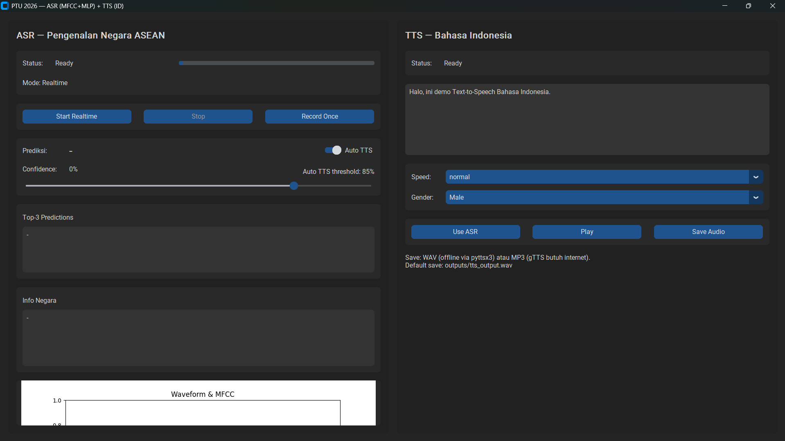

### Web Dashboard

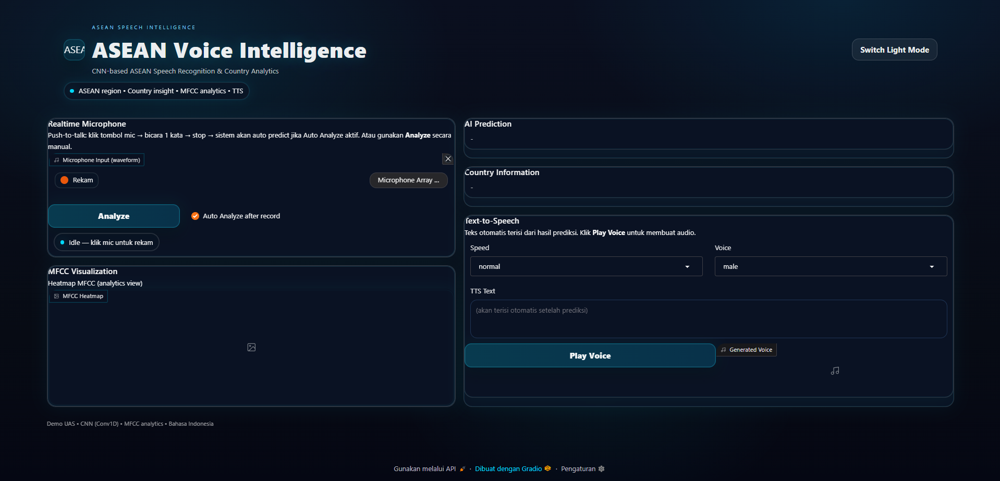

### Realtime Prediction

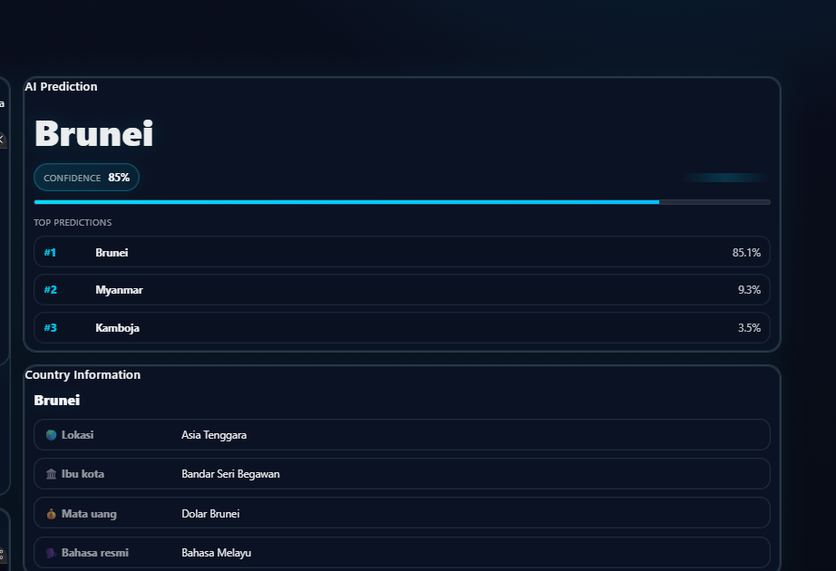

### MFCC Visualization

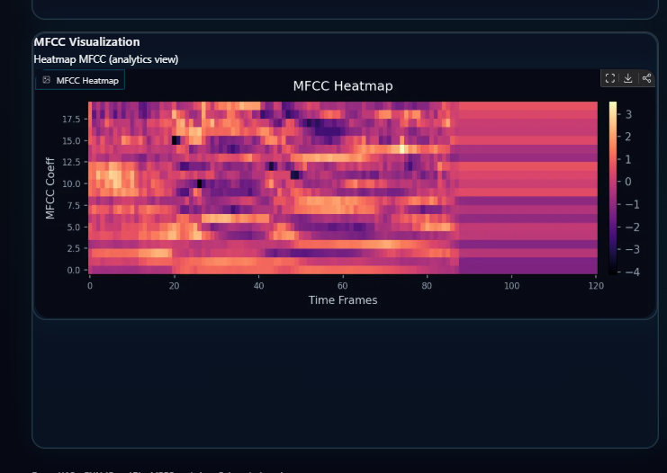

### CNN Evaluation

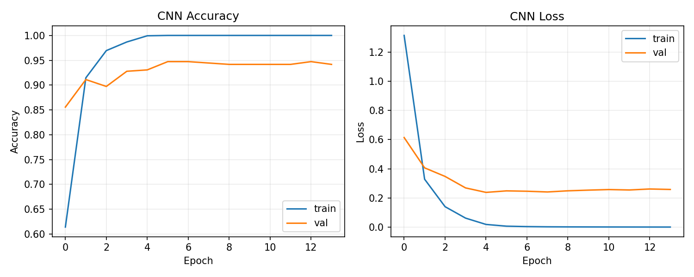

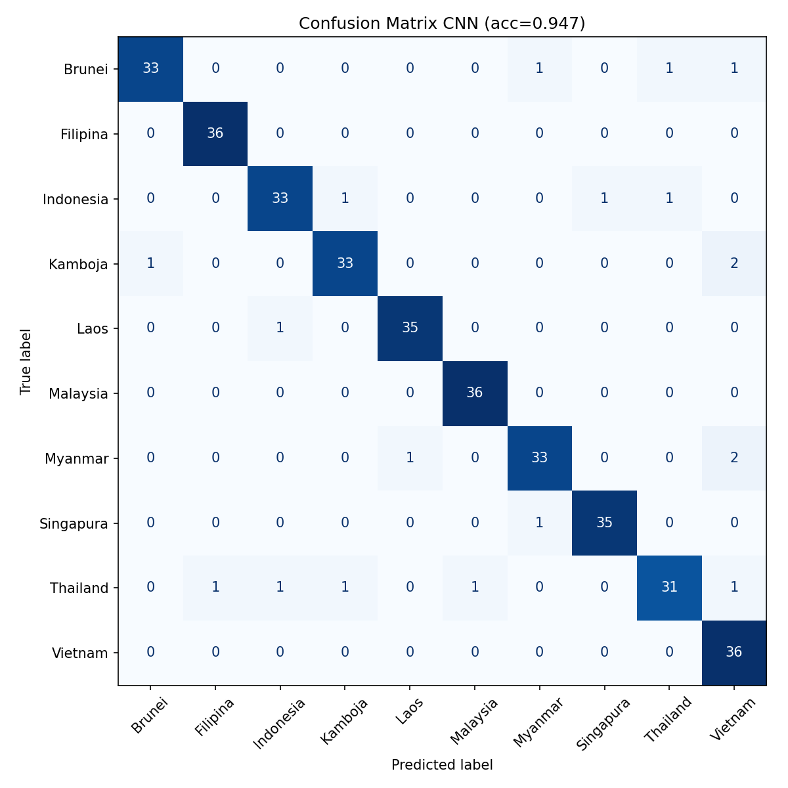

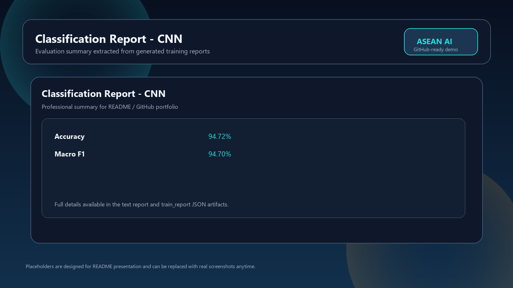

### MLP Evaluation

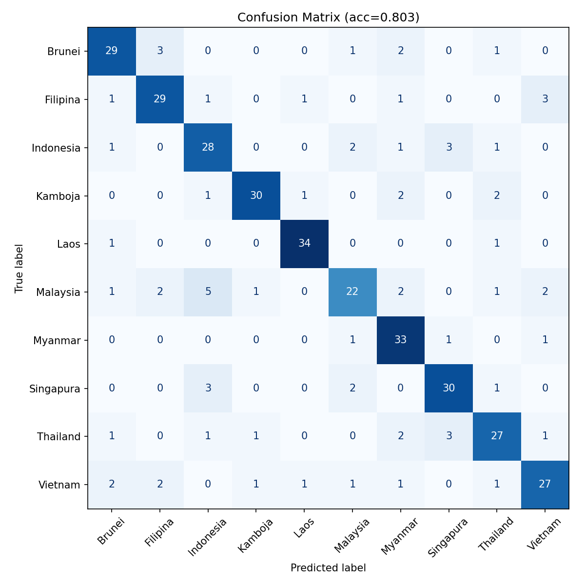


### TTS Output

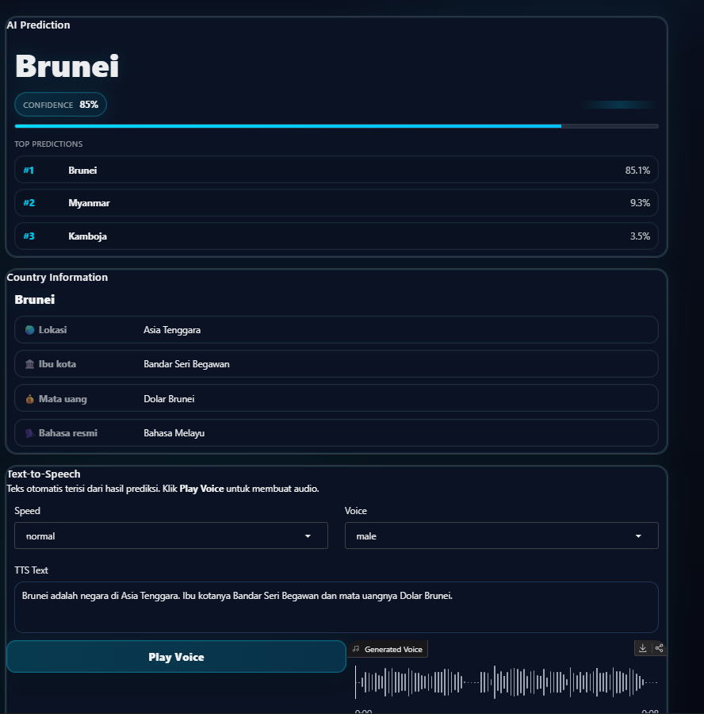

## Suggested Badges

Badge yang cocok untuk repository ini:

- Python
- TensorFlow
- Gradio
- CustomTkinter
- librosa / MFCC
- scikit-learn / MLP
- CNN
- ASR
- TTS

Contoh penggunaan badge tambahan bila ingin lebih lengkap:

```markdown
[](...)
[](...)
[](...)
```

## Final Docs

Dokumentasi pendukung yang sudah tersedia:

- `DEMO_STEPS.md` untuk urutan demo dan backup plan.
- `DOSEN_QNA.md` untuk pertanyaan teknis yang mungkin muncul.
- `PRESENTATION_SCRIPT.md` untuk naskah presentasi.
- `docs/NOTION_REPORT_TEMPLATE.md` untuk struktur laporan Notion.
- `docs/PRESENTATION_TEMPLATE.md` untuk template slide.

## Maintenance Notes

- Keep `requirements_web.txt` minimal agar tidak menarik dependency desktop yang tidak dibutuhkan.
- `utils/audio.py` memuat `sounddevice` secara lazy agar web dashboard tetap aman di-import.
- Untuk Gradio dark theme, gunakan styling yang konsisten agar tampilan tidak muncul sebagai white box.

## Project Status

Proyek ini sudah siap untuk presentasi UAS sebagai portfolio AI beginner-intermediate yang menonjolkan:

- pemahaman pipeline ASR,
- implementasi MFCC,
- klasifikasi audio sederhana,
- integrasi TTS,
- visualisasi hasil,
- dan penyajian dua antarmuka aplikasi yang profesional.
